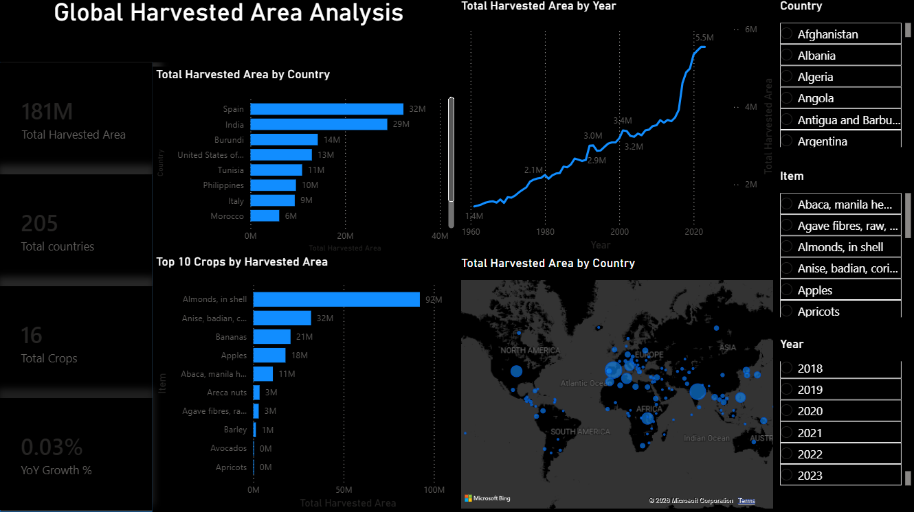

# Global Harvested Area Analysis

A Power BI data analysis project exploring global harvested area trends across countries, crops, and years from 1961 to 2023.

## Dashboard Preview

## Key Metrics

- Total Harvested Area: 181M ha
- Countries Analyzed: 205
- Crops Analyzed: 16
- Time Period: 1961–2023

## Dashboard Features

- Global harvested area trend analysis
- Top countries by harvested area
- Top crops by harvested area
- Interactive filtering by country, crop, and year
- Geographic analysis using an interactive map
- Year-over-Year (YoY) growth analysis

## Tools Used

- Power BI
- DAX
- Microsoft Excel
- Data Visualization
- Data Analysis

## Files

- `Power BI Global-Harvested-Area-Analysis.pbix` — Power BI dashboard
- `Global_Harvested_Area_Analysis.xlsx` — Cleaned dataset
- `dashboard.png` — Dashboard preview
